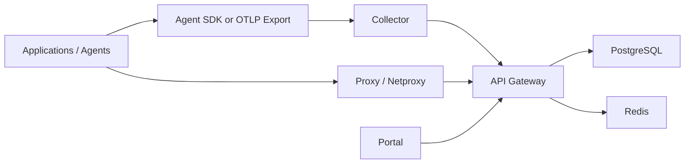

# AgentFabric

AgentFabric is a self-hosted AI runtime governance, observability, and control plane for LLM and agent workloads.

It is designed for enterprises that want to centralize:
- model and provider mediation
- runtime tracing and live operations
- policy and guardrail enforcement
- budget and pricing governance
- auditability of AI traffic and admin activity
- prompt release linkage and evaluation workflows

## What AgentFabric Does

AgentFabric combines several product surfaces into one control plane:

- `api-gateway`: central API, auth, policy, pricing, budget, key, prompt, eval, and proxy service
- `collector`: OTLP ingest and enrichment service for agent and application traces
- `portal`: operator and administrator UI
- `agent-sdk`: Python SDK and auto-instrumentation entrypoint for application onboarding
- `proxy` and `netproxy`: controlled model-access paths for routed LLM traffic
- PostgreSQL and Redis: required backing services for persistence and runtime coordination

## Current Product Scope

Implemented product areas in the current codebase:

- OTLP ingest over HTTP and gRPC
- trace, run, agent, environment, and live-stream views
- trace timelines, trace comparison, and saved views
- policy enforcement and policy simulation
- DLP-style request and response handling
- configurable pricing and budget governance
- virtual API key registration and management
- LLM proxy and transparent network proxy support
- evaluation scoring and regression comparison
- prompt versioning, promotion, and trace linkage
- control-plane and runtime audit trails
- OIDC or password-based browser authentication
- single shared or multi-tenant control-plane deployment models

## Repository Layout

- [agent-sdk](/C:/Users/vrast/Documents/Agentic%20Code/files/agent-sdk)
  Python SDK, auto-instrumentation, and prompt metadata linkage.
- [collector](/C:/Users/vrast/Documents/Agentic%20Code/files/collector)
  OTLP receiver, enrichment path, and gateway exporter.
- [api-gateway](/C:/Users/vrast/Documents/Agentic%20Code/files/api-gateway)
  Primary control plane and proxy surface.
- [portal](/C:/Users/vrast/Documents/Agentic%20Code/files/portal)
  React-based operator UI.
- [deploy](/C:/Users/vrast/Documents/Agentic%20Code/files/deploy)
  Migrations, Helm assets, Docker Compose overlays, and Kubernetes manifests.
- [docs](/C:/Users/vrast/Documents/Agentic%20Code/files/docs)
  Product, deployment, release, backup, and pilot documentation.
- [scripts](/C:/Users/vrast/Documents/Agentic%20Code/files/scripts)
  Bootstrap, validation, backup, pilot, and release-gate automation.

## Architecture at a Glance



Operationally:
- the collector ingests telemetry and forwards enriched spans to the gateway
- the gateway persists traces, enforces policy, resolves pricing, manages budgets, and exposes admin APIs
- the proxy and netproxy route governed LLM traffic through the gateway
- the portal consumes the gateway APIs for administration and investigation

See the full architecture guide in [ARCHITECTURE.md](/C:/Users/vrast/Documents/Agentic%20Code/files/docs/ARCHITECTURE.md).

## Portal Surfaces

The current portal includes:

- Dashboard
- Traces
- Trace Detail
- Trace Compare
- Live Stream
- Agents
- Cost
- Environments
- Users
- Audit
- API Keys
- Pricing
- Policies
- Policy Decision Explorer
- Policy Simulation
- Evals
- Regressions
- Prompts
- Prompt Release

## Deployment Models

AgentFabric supports two primary deployment shapes:

1. `Single tenant`
One shared control plane for one organization, program, or business unit.

2. `Multi tenant`
One shared control plane serving multiple onboarded teams, tenants, or environments with tenant-scoped governance and operations.

See:
- [INSTALL_SINGLE_TENANT.md](/C:/Users/vrast/Documents/Agentic%20Code/files/docs/INSTALL_SINGLE_TENANT.md)
- [INSTALL_MULTI_TENANT.md](/C:/Users/vrast/Documents/Agentic%20Code/files/docs/INSTALL_MULTI_TENANT.md)

## Provider Scope

The codebase includes provider adapters or routing support for:

- `openai`
- `anthropic`
- `google`
- `vertexai`
- `bedrock`

For production release positioning, keep release claims aligned with [RELEASE_BOUNDARIES.md](/C:/Users/vrast/Documents/Agentic%20Code/files/docs/RELEASE_BOUNDARIES.md). The most release-ready path remains the central control-plane experience around `openai`, `anthropic`, and `google`, while newer adapters should be described carefully until fully field-proven.

## Local Setup

Fastest local start on Windows PowerShell:

```powershell
powershell -ExecutionPolicy Bypass -File .\scripts\bootstrap_local.ps1
```

Fastest local start on macOS or Linux:

```bash
bash scripts/setup-local.sh
```

Common local endpoints:

- Portal: `http://localhost:3000`
- Gateway: `http://localhost:8080`
- Collector OTLP HTTP: `http://localhost:4318`
- Swagger UI: `http://localhost:8080/docs/swagger`

For full onboarding flows, see [SETUP_AND_ONBOARDING.md](/C:/Users/vrast/Documents/Agentic%20Code/files/docs/SETUP_AND_ONBOARDING.md).

## Production Deployment

Production-oriented assets in this repository include:

- [docker-compose.prod.yml](/C:/Users/vrast/Documents/Agentic%20Code/files/deploy/docker/docker-compose.prod.yml)
- [values.yaml](/C:/Users/vrast/Documents/Agentic%20Code/files/deploy/helm/values.yaml)
- [runtime-stack.yaml](/C:/Users/vrast/Documents/Agentic%20Code/files/deploy/helm/templates/runtime-stack.yaml)
- [networkpolicies.yaml](/C:/Users/vrast/Documents/Agentic%20Code/files/deploy/helm/templates/networkpolicies.yaml)
- [backup-cronjob.yaml](/C:/Users/vrast/Documents/Agentic%20Code/files/deploy/helm/templates/backup-cronjob.yaml)

Supporting operational documents:

- [REFERENCE_DEPLOYMENT.md](/C:/Users/vrast/Documents/Agentic%20Code/files/docs/REFERENCE_DEPLOYMENT.md)
- [PRODUCTION_CHECKLIST.md](/C:/Users/vrast/Documents/Agentic%20Code/files/docs/PRODUCTION_CHECKLIST.md)
- [BACKUP_RESTORE.md](/C:/Users/vrast/Documents/Agentic%20Code/files/docs/BACKUP_RESTORE.md)
- [HA_GUIDE.md](/C:/Users/vrast/Documents/Agentic%20Code/files/docs/HA_GUIDE.md)
- [SSO_RBAC_PLAN.md](/C:/Users/vrast/Documents/Agentic%20Code/files/docs/SSO_RBAC_PLAN.md)

## API and Integration Surfaces

Primary gateway endpoints:

- health and readiness: `/healthz`, `/readyz`
- auth: `/auth/login`, `/auth/callback`, `/auth/logout`, `/auth/me`, `/auth/refresh`
- traces and live operations: `/api/v1/traces`, `/api/v1/stream/live`
- pricing, budgets, and policies: `/api/v1/pricing`, `/api/v1/budgets`, `/api/v1/policies`
- keys, prompts, and evals: `/api/v1/keys`, `/api/v1/prompts`, `/api/v1/evals`
- proxy: `/proxy/{provider}/...`
- collector ingest: `/internal/ingest`

API references:

- [openapi.yaml](/C:/Users/vrast/Documents/Agentic%20Code/files/docs/openapi.yaml)
- [API_GUIDE.md](/C:/Users/vrast/Documents/Agentic%20Code/files/docs/API_GUIDE.md)

## Validation and Release Gating

The repository includes release and pilot validation scripts:

- [run_release_candidate_validation.ps1](/C:/Users/vrast/Documents/Agentic%20Code/files/scripts/run_release_candidate_validation.ps1)
- [probe_stack_health.ps1](/C:/Users/vrast/Documents/Agentic%20Code/files/scripts/probe_stack_health.ps1)
- [probe_proxy_path.ps1](/C:/Users/vrast/Documents/Agentic%20Code/files/scripts/probe_proxy_path.ps1)
- [run_ga_gate.ps1](/C:/Users/vrast/Documents/Agentic%20Code/files/scripts/run_ga_gate.ps1)
- [run_local_pilot_validation.ps1](/C:/Users/vrast/Documents/Agentic%20Code/files/scripts/run_local_pilot_validation.ps1)

Use the shell equivalents in [scripts](/C:/Users/vrast/Documents/Agentic%20Code/files/scripts) for macOS or Linux environments.

## Current Maturity

Recommended positioning today:

`pre-GA / controlled beta`

The codebase is substantial and production-directed, but release claims should remain aligned with:
- validated deployment evidence
- provider maturity
- staging and pilot proof
- the current release boundary documents

## Documentation Guide

Start here:

- [ARCHITECTURE.md](/C:/Users/vrast/Documents/Agentic%20Code/files/docs/ARCHITECTURE.md)
- [SETUP_AND_ONBOARDING.md](/C:/Users/vrast/Documents/Agentic%20Code/files/docs/SETUP_AND_ONBOARDING.md)
- [API_GUIDE.md](/C:/Users/vrast/Documents/Agentic%20Code/files/docs/API_GUIDE.md)
- [INSTALL_SINGLE_TENANT.md](/C:/Users/vrast/Documents/Agentic%20Code/files/docs/INSTALL_SINGLE_TENANT.md)
- [INSTALL_MULTI_TENANT.md](/C:/Users/vrast/Documents/Agentic%20Code/files/docs/INSTALL_MULTI_TENANT.md)
- [QUICKSTART.md](/C:/Users/vrast/Documents/Agentic%20Code/files/docs/QUICKSTART.md)

## License

Proprietary. All rights reserved.
