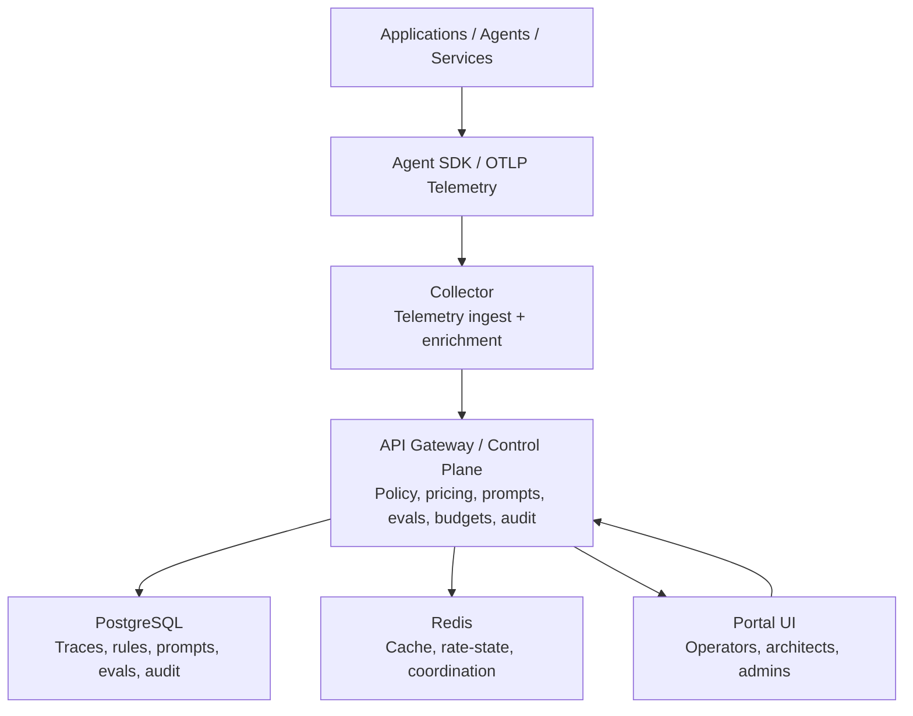
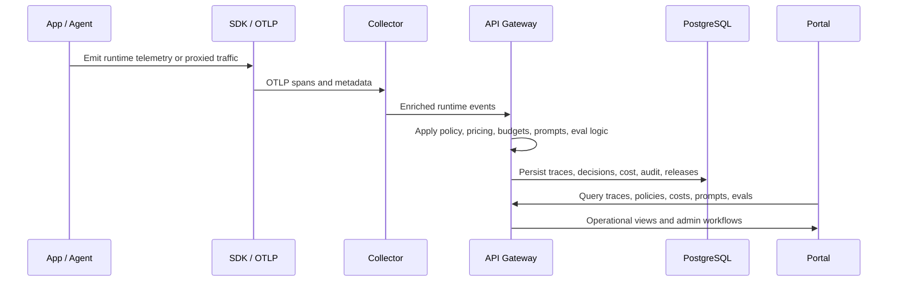

# GOVAGN

**Enterprise AI runtime governance, observability, and control plane for controlled LLM and agent rollouts.**

Self-hosted. Policy-driven. Cost-aware. Controlled-production candidate.


## What Is GOVAGN?

GOVAGN is a self-hosted platform for teams that need to **observe, govern, and control AI runtime traffic** across applications, services, and autonomous agents.

It brings together three enterprise capability areas in one platform:

- **Observability** for traces, spans, execution lineage, live runtime activity, failures, and cost provenance
- **Governance** for policy enforcement, guardrails, DLP-style controls, auditability, and release checks
- **Runtime control** for model mediation, provider management, pricing, budgets, prompt lifecycle, and evaluation workflows

Think of GOVAGN as a **control plane for enterprise AI operations**.

## Why GOVAGN?

As AI workloads move from experimentation to production, enterprise teams run into the same problems:

- model access becomes fragmented across teams and applications
- token usage and spend are difficult to attribute
- prompt and release changes are hard to trace
- policy decisions are not visible at runtime
- security, platform, and architecture teams lack one operational surface
- governance becomes reactive instead of enforced

GOVAGN addresses that by placing AI runtime behavior behind a governed operational layer.

## What The Platform Can Do

### Runtime observability
- trace LLM and agent execution across requests, spans, retries, failures, and handoffs
- inspect lineage, blocked spans, redactions, token usage, and pricing provenance
- compare traces side by side
- stream live runtime events to operators

### Governance and guardrails
- enforce traffic and DLP rules
- apply policy-driven guardrails
- preview and simulate policy decisions before rollout
- maintain audit trails for runtime and administrative actions

### Cost and FinOps
- compute per-request and per-span cost
- apply pricing rules with tenant-aware overrides
- break down input, output, cache, and reasoning cost categories
- support budget and release-governance workflows

### Prompt and release lifecycle
- version prompts
- promote prompts across environments
- link traces back to prompt versions and releases
- support evaluation and regression analysis across release tags

### Enterprise deployment
- self-hosted Docker Compose deployment
- Kubernetes / Helm deployment path
- on-premise-friendly operating model
- staging validation and GA gate workflows for controlled rollouts

## Architecture

### High-Level Architecture



### Runtime Flow



For the full architecture view, see [docs/ARCHITECTURE.md](docs/ARCHITECTURE.md).

## Core Components

| Component | Role |
|---|---|
| `api-gateway/` | Central governance, policy, pricing, budget, prompt, eval, and audit control plane |
| `collector/` | OTLP ingestion and telemetry enrichment |
| `portal/` | Operator and administrator UI |
| `agent-sdk/` | Python instrumentation and runtime linkage |
| `PostgreSQL` | Primary system of record |
| `Redis` | Supporting cache and coordination layer |

## Technology And Frameworks

### Backend services
- **Language/runtime:** Go 1.22 (`api-gateway/go.mod`, `collector/go.mod`)
- **Gateway framework/libs:** Chi router, CORS middleware, JWT, pgx/PostgreSQL, go-redis, Gorilla WebSocket, Prometheus client, Zap logging
- **Collector protocol stack:** OTLP over gRPC/HTTP (`go.opentelemetry.io/proto/otlp`, `google.golang.org/grpc`)

### Portal UI
- **Framework:** React 18 + TypeScript + Vite (`portal/package.json`)
- **Key libraries:** TanStack React Query, React Router, Recharts, D3, Zustand
- **Testing:** Vitest + Playwright

### SDK and instrumentation
- **SDK language/runtime:** Python >=3.9 (`agent-sdk/pyproject.toml`)
- **Telemetry foundation:** OpenTelemetry API/SDK + OTLP gRPC exporter
- **Optional framework integrations:** CrewAI, LangChain, LangGraph, OpenAI, Anthropic

### Infrastructure and operations
- **Runtime/deploy:** Docker Compose + Helm
- **State and cache:** PostgreSQL 16 + Redis 7 (`docker-compose.yml`)
- **Observability stack:** Prometheus, Alertmanager, Grafana, Jaeger
- **CI:** GitHub Actions for Go, TypeScript, Python, Helm, packaging, and security checks (`.github/workflows/ci.yml`)

## Product-Market Fit

### Ideal customer profile
- Enterprise AI platform teams
- Security and governance organizations
- Architecture teams standardizing runtime controls
- Regulated organizations running internal LLM workloads

### Problem GOVAGN solves
- AI usage is fragmented across apps and teams
- Runtime policy and guardrail decisions are hard to enforce consistently
- Cost attribution and budget control are weak or delayed
- Prompt and release changes are difficult to audit end-to-end

### Why it fits this market
- Unifies governance, observability, and runtime control in one self-hosted control plane
- Connects runtime traces to policy, prompts, pricing, and audit records
- Supports controlled rollout patterns needed by enterprise and regulated environments

### Not a fit
- Consumer chatbot products
- Prompt playground-only workflows
- Pure research experimentation stacks without governance requirements

## Best-Fit Use Cases

GOVAGN is best suited for:

- enterprise AI platform teams
- architecture teams standardizing AI runtime controls
- security and governance organizations
- internal developer platforms
- regulated environments that need auditability and runtime control
- delivery teams operating LLM-backed applications in production

## Deployment Modes

- local development with Docker Compose
- single-tenant deployment for one platform or business unit
- multi-tenant deployment for shared internal platform use
- Kubernetes / Helm deployment for production environments
- enterprise-friendly on-premise deployment model

Installation guides:

- [docs/SETUP_AND_ONBOARDING.md](docs/SETUP_AND_ONBOARDING.md)
- [docs/INSTALL_SINGLE_TENANT.md](docs/INSTALL_SINGLE_TENANT.md)
- [docs/INSTALL_MULTI_TENANT.md](docs/INSTALL_MULTI_TENANT.md)

## Repository Layout

```text
agent-sdk/        Python SDK and instrumentation
api-gateway/      Go control plane and gateway logic
collector/        Go telemetry collector
portal/           React + TypeScript operations portal
deploy/           Docker, Helm, manifests, migrations
docs/             architecture, setup, API, and operations docs
tests/            governance, eval, e2e, and validation suites
scripts/          probes, pilot validation, release, and GA gate scripts
```

## Quick Start

### How to use GOVAGN locally
1. Bootstrap the local stack.
   Windows PowerShell:
   ```powershell
   powershell -ExecutionPolicy Bypass -File .\scripts\bootstrap_local.ps1
   ```
   macOS/Linux:
   ```bash
   bash scripts/setup-local.sh
   ```
2. Open the platform URLs.
   - Portal: `http://localhost:3000`
   - Gateway: `http://localhost:8080`
   - Collector OTLP HTTP: `http://localhost:4318`
   - Swagger UI: `http://localhost:8080/docs/swagger`
3. Sign in as local admin and verify core pages load (traces, policies, cost, prompts).
4. Register at least one provider key for proxied runtime traffic.
5. Send one instrumented or proxied request and confirm trace + cost + policy visibility.
6. Run release validation scripts when you want staging-grade evidence.

Alternative local start:
```bash
make dev
```

### Production
1. Deploy with Helm or production Compose
2. Configure auth, secrets, database, Redis, and ingress
3. Apply migrations
4. Run stack health and proxy probes against the candidate deployment
5. Run release-candidate validation with governance scenarios enabled
6. Run the GA gate after staging evidence, packaging evidence, and blocker review are complete

## Documentation

- [docs/ARCHITECTURE.md](docs/ARCHITECTURE.md)
- [docs/SETUP_AND_ONBOARDING.md](docs/SETUP_AND_ONBOARDING.md)
- [docs/API_GUIDE.md](docs/API_GUIDE.md)
- [docs/INSTALL_SINGLE_TENANT.md](docs/INSTALL_SINGLE_TENANT.md)
- [docs/INSTALL_MULTI_TENANT.md](docs/INSTALL_MULTI_TENANT.md)
- [docs/PRODUCTION_CHECKLIST.md](docs/PRODUCTION_CHECKLIST.md)
- [docs/RELEASE_BOUNDARIES.md](docs/RELEASE_BOUNDARIES.md)
- [docs/BACKUP_RESTORE.md](docs/BACKUP_RESTORE.md)
- [docs/PILOT_PLAYBOOK.md](docs/PILOT_PLAYBOOK.md)

## Supported Product Shape

GOVAGN is strongest as:

**AI runtime governance + observability + control plane**

It is not intended to be:

- a prompt playground
- a generic chatbot framework
- a research experimentation lab
- a consumer-facing AI app

## Provider Scope

The codebase currently includes provider adapters or routing support for:

- `openai`
- `anthropic`
- `google`
- `vertexai`
- `bedrock`

Release claims should stay aligned with [docs/RELEASE_BOUNDARIES.md](docs/RELEASE_BOUNDARIES.md), especially for providers that are newer or less field-proven.

## Validation and Release Gating

The repository ships two different levels of release evidence:

- merge-gate CI in [`.github/workflows/ci.yml`](.github/workflows/ci.yml), which verifies collector and gateway `go test ./...`, portal tests/build, agent-sdk unit tests, OpenAPI smoke, Helm and Compose render smoke, secret scan, and release-doc alignment
- candidate-environment validation, which still requires stack probes, proxy-path proof, release-candidate validation, governance scenarios, and operational backup/restore review before GA

Framework compatibility evidence is intentionally separate:

- [`.github/workflows/sdk-integration.yml`](.github/workflows/sdk-integration.yml) runs the heavier SDK/framework matrix on schedule, manually, and on SDK workflow changes
- treat the latest green `sdk-integration.yml` run as required release evidence when a release changes `agent-sdk`, framework patching behavior, or provider-compatibility claims

The repository also includes environment proof and release validation scripts:

- `scripts/probe_stack_health.ps1`
- `scripts/probe_proxy_path.ps1`
- `scripts/run_release_candidate_validation.ps1`
- `scripts/run_local_pilot_validation.ps1`
- `scripts/run_ga_gate.ps1`

Shell equivalents are available in the same [scripts/](scripts) directory for macOS and Linux environments.

## Maturity

GOVAGN is a serious platform foundation intended for:

- internal platform evaluation
- controlled pilots
- enterprise architecture review
- governed rollout of AI runtime capabilities

Recommended positioning today:

- enterprise beta
- internal pilot
- controlled production candidate

## License

- Top-level repository license: see [LICENSE](LICENSE) (**proprietary**).
- Platform repository (`api-gateway`, `collector`, `portal`, deployment assets): **Proprietary. All rights reserved.**
- Python SDK package metadata (`agent-sdk/pyproject.toml`): **MIT**.
