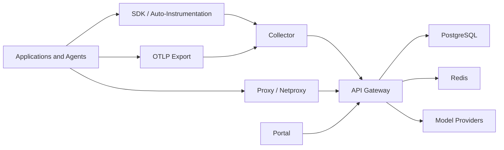

# AgentFabric Architecture

## Purpose

AgentFabric is a central control-plane architecture for governed AI runtime operations. It is built to sit between enterprise applications and external model providers while also ingesting runtime telemetry from instrumented services.

The architecture is optimized around five concerns:

- observability of agent and LLM workflows
- control of routed model traffic
- policy and guardrail enforcement
- pricing, budget, and usage governance
- auditability of both runtime and administrative actions

## Core Components

### 1. Agent SDK

Location:
- [agent-sdk](/C:/Users/vrast/Documents/Agentic%20Code/files/agent-sdk)

Responsibilities:
- Python auto-instrumentation
- framework patching and span creation
- prompt metadata attachment
- application-side onboarding for trace collection

### 2. Collector

Location:
- [collector](/C:/Users/vrast/Documents/Agentic%20Code/files/collector)

Responsibilities:
- OTLP HTTP and gRPC ingest
- telemetry normalization and enrichment
- forwarding batches into the gateway ingest path
- readiness validation of gateway export configuration

Exposed endpoints:
- `/v1/traces`
- `/metrics`
- `/healthz`
- `/readyz`

### 3. API Gateway

Location:
- [api-gateway](/C:/Users/vrast/Documents/Agentic%20Code/files/api-gateway)

Responsibilities:
- browser and API authentication
- tenant-aware control-plane APIs
- trace, run, analytics, prompt, eval, and governance APIs
- pricing rule loading and resolution
- budget enforcement
- key management
- policy and guardrail evaluation
- audit recording
- LLM proxy and transparent network proxy handling

Exposed surfaces include:
- health and readiness
- auth endpoints
- admin APIs
- proxy path
- internal collector ingest

### 4. Portal

Location:
- [portal](/C:/Users/vrast/Documents/Agentic%20Code/files/portal)

Responsibilities:
- trace investigation
- live operations monitoring
- pricing, policies, budgets, and keys management
- audit and administrative review
- prompt lifecycle and evaluation UI

### 5. Data Stores

Required backing services:
- PostgreSQL
- Redis

PostgreSQL is the system of record for:
- traces and runs
- pricing rules
- policies and guardrails
- audits
- prompts and releases
- evals and regressions
- users and tenant-scoped metadata

Redis is used for runtime coordination and low-latency support paths used by the gateway.

## High-Level Topology

## Main Runtime Flows

### Trace ingestion flow

1. An application emits spans through the SDK or OTLP.
2. The collector receives, enriches, and forwards those spans.
3. The gateway stores and exposes them through trace and analytics APIs.
4. The portal renders traces, comparisons, timelines, and live views.

### Proxy enforcement flow

1. A workload sends LLM traffic through `/proxy/{provider}/...` or the transparent netproxy path.
2. The gateway resolves the provider adapter and pricing behavior.
3. Policy and guardrail evaluation runs inline.
4. Usage, cost, policy events, and audit records are attached to the resulting trace.
5. The portal exposes the request outcome for operators.

### Prompt lifecycle flow

1. Prompt versions and releases are created in the control plane.
2. Applications attach prompt identifiers or versions through instrumentation.
3. Those prompt identifiers are linked to runtime spans and traces.
4. Operators can navigate from traces to prompt releases.

### Evaluation flow

1. The gateway scores enriched traces using built-in eval scorers.
2. Eval runs are persisted.
3. Candidate and baseline release tags can be compared.
4. Regressions and policy-effectiveness summaries are exposed in the portal.

## Authentication and Access Model

The gateway supports:

- password-based browser login
- OIDC login with PKCE
- HttpOnly cookie-based session usage for the portal
- Bearer JWT support for authenticated API clients
- virtual keys for proxy traffic
- collector bearer auth for internal ingest

Production-relevant controls include:

- `AF_SSO_REQUIRED`
- `AF_PASSWORD_LOGIN_DISABLED`
- `AF_JWT_SECRET`
- `AF_JWT_SECRETS`

See:
- [SSO_RBAC_PLAN.md](/C:/Users/vrast/Documents/Agentic%20Code/files/docs/SSO_RBAC_PLAN.md)

## Tenancy Model

AgentFabric is built for central deployment. A single control plane can serve:

- one tenant
- multiple internal tenants
- multiple delivery teams or environments

In practice, the tenancy boundary affects:

- users
- budgets
- pricing rules
- policies
- key management
- prompt catalogs
- traces and analytics access

For deployment guidance, see:
- [INSTALL_SINGLE_TENANT.md](/C:/Users/vrast/Documents/Agentic%20Code/files/docs/INSTALL_SINGLE_TENANT.md)
- [INSTALL_MULTI_TENANT.md](/C:/Users/vrast/Documents/Agentic%20Code/files/docs/INSTALL_MULTI_TENANT.md)

## Provider and Proxy Model

The current codebase includes provider registry support for:

- `openai`
- `anthropic`
- `google`
- `vertexai`
- `bedrock`

The proxy path is where AgentFabric combines:

- provider mediation
- policy evaluation
- guardrails
- usage extraction
- pricing resolution
- audit and trace linkage

Release claims should stay aligned with [RELEASE_BOUNDARIES.md](/C:/Users/vrast/Documents/Agentic%20Code/files/docs/RELEASE_BOUNDARIES.md).

## Readiness and Operational Checks

Gateway:
- `/healthz`
- `/readyz`

Collector:
- `/healthz`
- `/readyz`

The readiness path is intended to be meaningful, not just process-up. Current checks include backing-service and startup-state dependencies such as pricing and policy availability.

## Deployment Shapes

### Single tenant

Recommended when:
- one org or one program owns the full platform
- one admin model is sufficient
- the operational boundary is simple

### Multi tenant

Recommended when:
- several teams or business units share one platform
- tenant-specific controls are required
- one central platform team operates the service

## Operational Assets

Key deployment and operations assets:

- [docker-compose.prod.yml](/C:/Users/vrast/Documents/Agentic%20Code/files/deploy/docker/docker-compose.prod.yml)
- [values.yaml](/C:/Users/vrast/Documents/Agentic%20Code/files/deploy/helm/values.yaml)
- [networkpolicies.yaml](/C:/Users/vrast/Documents/Agentic%20Code/files/deploy/helm/templates/networkpolicies.yaml)
- [backup-cronjob.yaml](/C:/Users/vrast/Documents/Agentic%20Code/files/deploy/helm/templates/backup-cronjob.yaml)
- [BACKUP_RESTORE.md](/C:/Users/vrast/Documents/Agentic%20Code/files/docs/BACKUP_RESTORE.md)
- [HA_GUIDE.md](/C:/Users/vrast/Documents/Agentic%20Code/files/docs/HA_GUIDE.md)

## Architecture Constraints

Important boundaries to communicate clearly:

- AgentFabric does not automatically observe unmanaged hosts.
- Coverage depends on onboarding through SDK, OTLP, proxy, or netproxy paths.
- The platform is a governed AI runtime control plane, not a generic infrastructure monitoring product.
- Production readiness depends on deployment validation, release-gate evidence, and pilot proof, not code presence alone.
