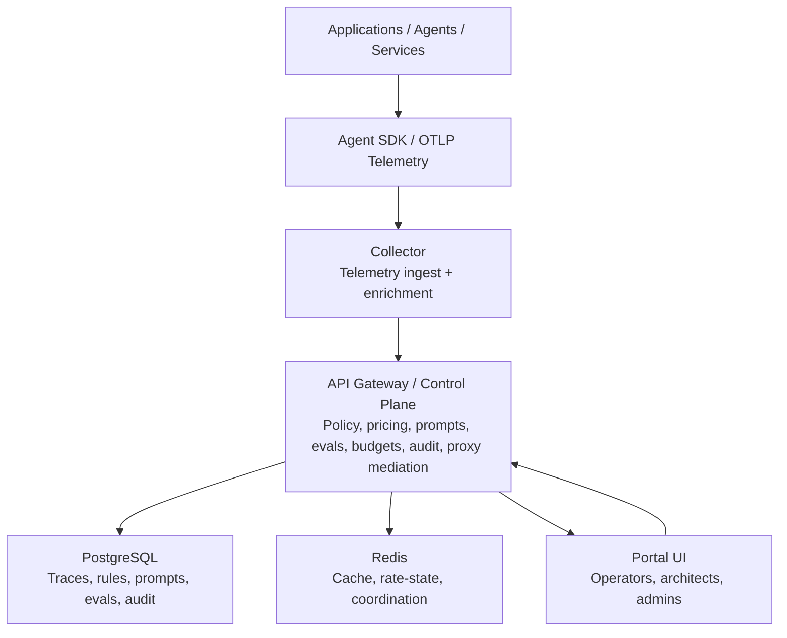
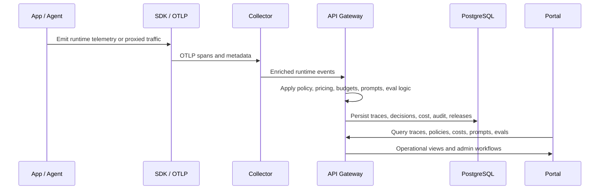

# AgentFabric Architecture

## Overview

AgentFabric is a self-hosted AI runtime governance, observability, and control-plane platform for production LLM and agent workloads.

Its architectural purpose is to place enterprise AI traffic behind a governed operational layer that can:

- observe runtime behavior
- enforce policy and guardrails
- attribute cost and usage
- manage prompt and release lifecycle
- support evaluation and release decisions
- provide operators with one control surface

AgentFabric is not a generic AI application framework. It is an infrastructure and operations platform for teams running AI workloads in production.

## Architectural Principles

### 1. Control plane first
AgentFabric is designed as a centralized control plane for AI runtime operations rather than a set of isolated monitoring utilities.

### 2. Self-hosted by default
The system is optimized for environments that require deployment control, network control, and enterprise data handling.

### 3. Governance is runtime-native
Policy, audit, pricing, budget, prompt release, and evaluation concerns are treated as runtime concerns, not after-the-fact reporting.

### 4. Observability must explain operations
The platform is designed to make traces useful for debugging, policy inspection, and spend visibility, not just telemetry collection.

### 5. Product boundaries are intentional
AgentFabric focuses on governance, observability, and runtime control rather than trying to become a prompt IDE, experimentation lab, or chatbot builder.

## High-Level Architecture

## Runtime Flow

## Core Components

### API Gateway
The API Gateway is the central control-plane service.

Responsibilities:

- authentication and authorization
- policy evaluation entry points
- pricing and budget logic
- prompt lifecycle APIs
- evaluation and regression APIs
- audit and governance workflows
- proxy and model mediation
- release and readiness control paths

### Collector
The Collector ingests telemetry and prepares runtime data for the control plane.

Responsibilities:

- OTLP ingestion
- span enrichment
- runtime metadata normalization
- observability data shaping
- cost and usage context propagation

### Portal
The Portal is the operational UI for administrators, platform teams, and operators.

Responsibilities:

- trace and live runtime visibility
- policy management and simulation
- pricing and cost analysis
- prompt version and release management
- eval and regression review
- administrative workflows and audit visibility

Live runtime visibility is backed by an in-memory WebSocket hub in the API gateway today, so `/api/v1/stream/live` is only supported with a single gateway replica when complete event delivery matters.

### Agent SDK
The SDK provides workload onboarding and runtime linkage.

Responsibilities:

- instrumentation
- runtime metadata propagation
- prompt and release linkage
- trace context propagation

### PostgreSQL
Primary system of record for:

- traces and spans
- policy rules
- pricing rules
- prompt versions and prompt releases
- eval runs and regressions
- audit records
- supporting control-plane metadata

### Redis
Supporting runtime subsystem for:

- cache and coordination
- transient state
- rate and state support
- performance-sensitive control-plane operations

## Capability Domains

### Observability

- trace detail
- span lineage
- live event views
- cost provenance
- policy visibility inside traces
- trace comparison

### Governance

- policy enforcement
- guardrails
- DLP-style protections
- simulation and preview
- auditability

### FinOps

- pricing rules
- category-level cost attribution
- budget workflows
- release-readiness evidence

### Prompt Lifecycle

- prompt versions
- release promotion
- trace-to-prompt linkage

### Evaluation

- eval scoring
- release regressions
- governance validation support

## Deployment Topologies

### Single-Tenant
Best for:

- one platform team
- one business unit
- one environment boundary

Characteristics:

- simplest operational model
- easier onboarding
- lower governance complexity

### Multi-Tenant
Best for:

- shared internal platform
- multiple teams or business units
- centralized governance with scoped separation

Characteristics:

- tenant-scoped policy and pricing overrides
- stronger platform governance model
- higher operational discipline required

See:

- [INSTALL_SINGLE_TENANT.md](INSTALL_SINGLE_TENANT.md)
- [INSTALL_MULTI_TENANT.md](INSTALL_MULTI_TENANT.md)

## Authentication and Access Model

The gateway supports:

- password-based browser login
- OIDC login with PKCE
- HttpOnly cookie-based session usage for the portal
- Bearer JWT support for authenticated API clients
- virtual keys for proxy traffic
- collector bearer auth for internal ingest

Production-relevant controls include:

- `AF_SSO_REQUIRED`
- `AF_PASSWORD_LOGIN_DISABLED`
- `AF_JWT_SECRET`
- `AF_JWT_SECRETS`
- `AF_GATEWAY_AUTH_TOKEN` for collector -> gateway `/internal/ingest`

See [SSO_RBAC_PLAN.md](SSO_RBAC_PLAN.md).

## Tenancy Model

AgentFabric is built for central deployment. A single control plane can serve:

- one tenant
- multiple internal tenants
- multiple delivery teams or environments

In practice, the tenancy boundary affects:

- users
- budgets
- pricing rules
- policies
- key management
- prompt catalogs
- traces and analytics access

## Provider and Proxy Model

The current codebase includes provider registry support for:

- `openai`
- `anthropic`
- `google`
- `vertexai`
- `bedrock`

The proxy path is where AgentFabric combines:

- provider mediation
- policy evaluation
- guardrails
- usage extraction
- pricing resolution
- audit and trace linkage

Release claims should stay aligned with [RELEASE_BOUNDARIES.md](RELEASE_BOUNDARIES.md).

## Readiness and Operational Checks

Gateway:

- `/healthz`
- `/readyz`

Collector:

- `/healthz`
- `/readyz`

The readiness path is intended to be meaningful, not just process-up. Current checks include backing-service and startup-state dependencies such as pricing and policy availability.

## Operational Assets

Key deployment and operations assets:

- [../deploy/docker/docker-compose.prod.yml](../deploy/docker/docker-compose.prod.yml)
- [../deploy/helm/values.yaml](../deploy/helm/values.yaml)
- [../deploy/helm/templates/networkpolicies.yaml](../deploy/helm/templates/networkpolicies.yaml)
- [../deploy/helm/templates/backup-cronjob.yaml](../deploy/helm/templates/backup-cronjob.yaml)
- [BACKUP_RESTORE.md](BACKUP_RESTORE.md)
- [HA_GUIDE.md](HA_GUIDE.md)

## Architecture Constraints

Important boundaries to communicate clearly:

- AgentFabric does not automatically observe unmanaged hosts.
- Coverage depends on onboarding through SDK, OTLP, proxy, or netproxy paths.
- The platform is a governed AI runtime control plane, not a generic infrastructure monitoring product.
- Production readiness depends on deployment validation, release-gate evidence, and pilot proof, not code presence alone.

## Current Maturity

The architecture supports serious pilot and controlled rollout scenarios.

Recommended maturity positioning:

- enterprise beta
- internal pilot
- controlled production candidate

Not yet:

- broad market GA claim without live pilot proof and broader operating evidence
