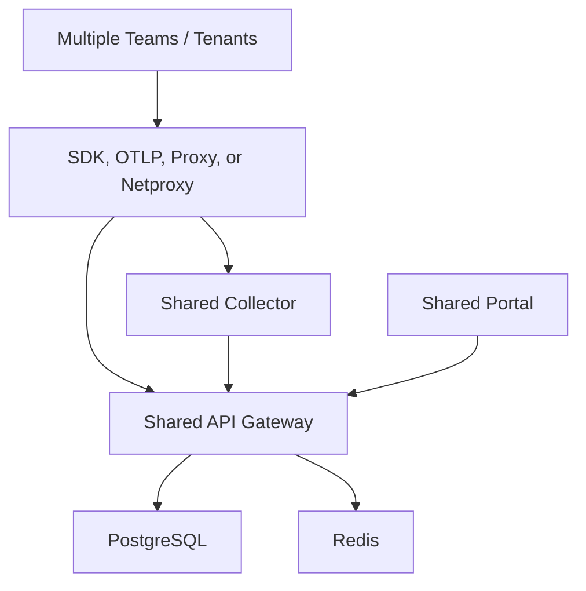

# Multi-Tenant Installation

## When To Use This Model

Use the multi-tenant model when:

- one shared platform serves multiple teams, programs, or business units
- a central architecture or platform team owns the control plane
- tenant-level governance, budgets, keys, prompts, and policies matter

This is the strategic shared-platform deployment shape for AgentFabric.

## Target Topology

## Multi-Tenant Operating Model

In this model, one control plane serves many onboarded tenants. Each tenant should have its own:

- users or access policy
- budgets
- pricing overrides where needed
- provider keys or key-management model
- policy defaults and guardrails
- prompt catalog or prompt release lineage

The platform team owns:

- deployment and upgrades
- auth posture
- platform-wide defaults
- backups and recovery
- release validation
- tenant onboarding patterns

## Required Components

- `api-gateway`
- `collector`
- `portal`
- PostgreSQL
- Redis

Strongly recommended:

- Kubernetes or another orchestrated environment
- ingress and TLS
- OIDC-based authentication
- network policy enforcement
- backup automation

## Recommended Deployment Path

Preferred:

- [../deploy/helm](../deploy/helm)

Important files:

- [../deploy/helm/values.yaml](../deploy/helm/values.yaml)
- [../deploy/helm/templates/runtime-stack.yaml](../deploy/helm/templates/runtime-stack.yaml)
- [../deploy/helm/templates/networkpolicies.yaml](../deploy/helm/templates/networkpolicies.yaml)
- [../deploy/helm/templates/backup-cronjob.yaml](../deploy/helm/templates/backup-cronjob.yaml)

## Core Configuration

At minimum, configure:

- `AF_JWT_SECRET`
- `AF_JWT_SECRETS` for rotation planning
- `AF_ADMIN_PASSWORD`
- `AF_VAULT_KEY`
- `DATABASE_URL`
- `REDIS_URL`
- `AF_CORS_ORIGINS`
- `AF_GATEWAY_AUTH_TOKEN`

For enterprise auth:

- `AF_OIDC_ISSUER`
- `AF_OIDC_CLIENT_ID`
- `AF_OIDC_CLIENT_SECRET`
- `AF_OIDC_REDIRECT_URI`
- `AF_SSO_REQUIRED=true`

After full SSO cutover:

- `AF_PASSWORD_LOGIN_DISABLED=true`

## Installation Sequence

1. Provision shared PostgreSQL and Redis.
2. Configure secrets and TLS posture.
3. Deploy the gateway with strict configuration enabled.
4. Deploy the collector and validate export auth.
5. Deploy the portal and restrict CORS to the real portal origins.
6. Enable network policies.
7. Enable backups.
8. Configure SSO.
9. Define tenant onboarding defaults.
10. Run readiness, proxy, governance, and GA validation.

## Tenant Onboarding Checklist

For each tenant, define:

- tenant identifier
- user access pattern
- provider enablement plan
- budget defaults
- pricing rule defaults
- policy and guardrail defaults
- prompt release expectations
- validation scenario ownership

Then validate:

- one successful trace
- one proxied request with cost
- one policy decision
- one audit event
- one operator workflow from event to trace to explanation

## Shared Platform Guardrails

A multi-tenant platform should standardize:

- default pricing policy
- approved provider list
- budget model
- audit retention
- backup schedule
- release-gate ownership
- migration and rollback ownership

## Backup, HA, and Recovery

Multi-tenant installations must treat backup and restore as mandatory.

Use:

- [BACKUP_RESTORE.md](BACKUP_RESTORE.md)
- [HA_GUIDE.md](HA_GUIDE.md)
- [SSO_RBAC_PLAN.md](SSO_RBAC_PLAN.md)

## Validation and Release Gate

A shared multi-tenant rollout should not proceed on architecture intent alone.

Run:

- [../scripts/probe_stack_health.ps1](../scripts/probe_stack_health.ps1)
- [../scripts/probe_proxy_path.ps1](../scripts/probe_proxy_path.ps1)
- [../scripts/run_release_candidate_validation.ps1](../scripts/run_release_candidate_validation.ps1)
- [../scripts/run_ga_gate.ps1](../scripts/run_ga_gate.ps1)

For broader internal or market-facing rollout, also include:

- [PILOT_PLAYBOOK.md](PILOT_PLAYBOOK.md)
- [CUSTOMER_VALUE_SCORECARD.md](CUSTOMER_VALUE_SCORECARD.md)

## What Good Looks Like

A healthy multi-tenant deployment has:

- a central platform owner
- standard tenant onboarding patterns
- validated tenant-scoped policy and pricing behavior
- backup and restore tested
- release and governance proof captured as evidence

## Recommended Fit

This model is the right choice when:

- Wipro or another enterprise wants one AI control plane for multiple delivery teams
- platform governance matters more than local team autonomy
- operations, security, and audit need a central point of control
