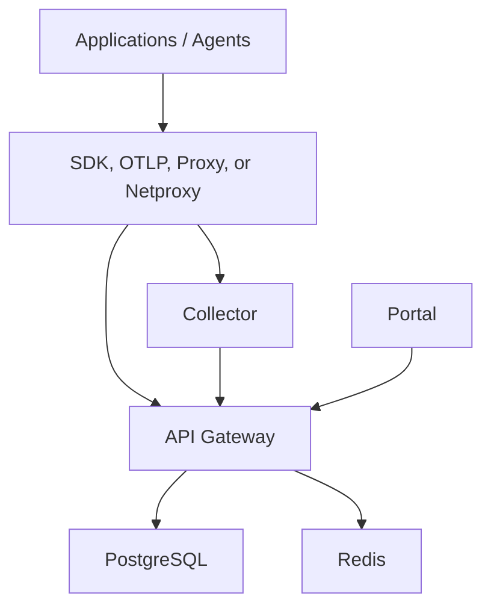

# Single-Tenant Installation

## When To Use This Model

Use the single-tenant model when:

- one organization, program, or business unit owns the platform
- one operations team manages the deployment
- tenant separation inside the control plane is not the primary design goal

This is the simplest production shape for AgentFabric and the recommended starting point for first serious rollout.

## Target Topology

## Required Components

- `api-gateway`
- `collector`
- `portal`
- PostgreSQL
- Redis

Recommended:

- ingress or reverse proxy
- TLS
- external secret management
- backup storage

## Deployment Options

### Option 1: Production-like Docker
Use:

- [../docker-compose.yml](../docker-compose.yml)
- [../deploy/docker/docker-compose.prod.yml](../deploy/docker/docker-compose.prod.yml)

### Option 2: Helm or Kubernetes
Use:

- [../deploy/helm/values.yaml](../deploy/helm/values.yaml)
- [../deploy/helm/templates/runtime-stack.yaml](../deploy/helm/templates/runtime-stack.yaml)

## Core Configuration

At minimum, configure:

- `AF_JWT_SECRET`
- `AF_ADMIN_PASSWORD`
- `AF_VAULT_KEY`
- `DATABASE_URL`
- `REDIS_URL`
- `AF_CORS_ORIGINS`
- `AF_GATEWAY_AUTH_TOKEN` shared between collector and gateway for `/internal/ingest` bearer auth
- `AF_ENV=production` or `AF_STRICT_CONFIG=true` on both gateway and collector
- `AF_AUTH_REQUIRE_AUTH=true` on the collector

If using OIDC:

- `AF_OIDC_ISSUER`
- `AF_OIDC_CLIENT_ID`
- `AF_OIDC_CLIENT_SECRET`
- `AF_OIDC_REDIRECT_URI`
- optional `AF_OIDC_LOGOUT_URL`

In strict production mode, do not set only part of the OIDC tuple. Any configured OIDC path must include issuer, client ID, client secret, and redirect URI together.

If enforcing SSO:

- `AF_SSO_REQUIRED=true`
- `AF_PASSWORD_LOGIN_DISABLED=true` after cutover

For Helm, set:

- `auth.ssoRequired: true`
- `auth.oidc.issuer`
- `auth.oidc.clientId`
- `auth.oidc.redirectUri`
- optional `auth.oidc.logoutUrl`
- store the OIDC client secret in the Kubernetes Secret named by `secrets.name` under the key from `auth.oidc.clientSecretKey` (default `oidc-client-secret`)

## Installation Sequence

1. Provision PostgreSQL and Redis.
2. Apply migrations.
3. Deploy the gateway.
4. Deploy the collector.
5. Deploy the portal.
6. Configure ingress and TLS.
7. Load pricing and policy defaults.
8. Create or confirm the first administrator.
9. Register the first provider key.
10. Run production probes and release validation.

## First-Day Operator Tasks

After the platform is live:

1. verify `/healthz` and `/readyz`
2. log in to the portal
3. confirm pricing rules are visible
4. confirm policy rules are visible
5. register one provider key
6. run one proxy request
7. verify one trace, one cost record, and one audit event

## Governance Baseline

Before onboarding the first real workload, configure:

- one budget rule
- one pricing rule
- one policy or guardrail
- one audit validation path
- one prompt lifecycle object for testing

Suggested first controls:

- deny or warn on clearly disallowed content
- configure a low test budget
- create one prompt version and release tag
- validate trace-to-prompt linkage

## Backup and Recovery

Single-tenant installations should still include:

- scheduled PostgreSQL backup
- restore procedure rehearsal
- retention settings

Use:

- [../deploy/helm/templates/backup-cronjob.yaml](../deploy/helm/templates/backup-cronjob.yaml)
- [BACKUP_RESTORE.md](BACKUP_RESTORE.md)
- [../scripts/backup_postgres.ps1](../scripts/backup_postgres.ps1)
- [../scripts/backup-postgres.sh](../scripts/backup-postgres.sh)

## Validation Before Use

Run:

- [../scripts/probe_stack_health.ps1](../scripts/probe_stack_health.ps1)
- [../scripts/probe_proxy_path.ps1](../scripts/probe_proxy_path.ps1)
- [../scripts/run_release_candidate_validation.ps1](../scripts/run_release_candidate_validation.ps1)

And use:

- [PRODUCTION_CHECKLIST.md](PRODUCTION_CHECKLIST.md)
- [REFERENCE_DEPLOYMENT.md](REFERENCE_DEPLOYMENT.md)

## What Good Looks Like

A healthy single-tenant deployment has:

- one working proxied or instrumented workload
- visible traces and cost breakdown
- at least one explainable policy decision
- one prompt release linked to runtime traces
- one successful staging or pilot validation run

## Recommended Fit

This model is the right starting point when:

- one platform owner wants simplicity
- rollout speed matters more than tenant hierarchy
- the first goal is proving value, not maximizing tenant isolation
