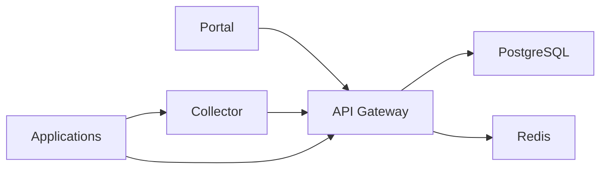

# Reference Deployment

## Purpose

This document defines the current reference deployment shape for AgentFabric.

Use it to answer:

- what components make up the supported runtime
- what the minimum serious deployment looks like
- what backing services are required
- what operational hardening is expected

## Current Reference Runtime

The reference deployment for the current product is:

- `api-gateway`
- `collector`
- `portal`
- external PostgreSQL
- external Redis

The current reference path does not require:

- Kafka
- ClickHouse
- retired `af-core` topology
- separate research or experimentation services

## Supported Deployment Environments

### Local
Use:

- [../docker-compose.yml](../docker-compose.yml)
- [../scripts/setup-local.sh](../scripts/setup-local.sh)
- [../scripts/bootstrap_local.ps1](../scripts/bootstrap_local.ps1)

### Production-like Docker
Use:

- [../docker-compose.yml](../docker-compose.yml)
- [../deploy/docker/docker-compose.prod.yml](../deploy/docker/docker-compose.prod.yml)

Required production inputs:

- `AF_JWT_SECRET`
- `AF_ADMIN_PASSWORD`
- `AF_VAULT_KEY`
- `AF_GATEWAY_AUTH_TOKEN` shared between collector and gateway for `/internal/ingest`
- `DATABASE_URL`
- `REDIS_URL`
- `AF_CORS_ORIGINS`
- `AF_ENV=production` or `AF_STRICT_CONFIG=true` on both gateway and collector
- `AF_AUTH_REQUIRE_AUTH=true` on the collector

### Kubernetes / Helm
Use:

- [../deploy/k8s/agentfabric.yaml](../deploy/k8s/agentfabric.yaml)
- [../deploy/helm](../deploy/helm)

For current release scope, treat PostgreSQL and Redis as required backing services and keep provider claims aligned with [RELEASE_BOUNDARIES.md](RELEASE_BOUNDARIES.md).

## Reference Topology

This is a central deployment model. One shared control plane can serve many teams, environments, and onboarded workloads inside the same organization or department.

## Operational Hardening

Production deployments should include:

- Helm network isolation from [../deploy/helm/templates/networkpolicies.yaml](../deploy/helm/templates/networkpolicies.yaml)
- scheduled PostgreSQL backups from [../deploy/helm/templates/backup-cronjob.yaml](../deploy/helm/templates/backup-cronjob.yaml)
- documented backup and restore procedure in [BACKUP_RESTORE.md](BACKUP_RESTORE.md)
- HA review in [HA_GUIDE.md](HA_GUIDE.md)
- enterprise auth rollout in [SSO_RBAC_PLAN.md](SSO_RBAC_PLAN.md)

Recommended production auth flags:

- `AF_SSO_REQUIRED=true` once OIDC is live
- `AF_PASSWORD_LOGIN_DISABLED=true` after SSO cutover
- when any OIDC fields are set in strict production mode, set issuer, client ID, client secret, and redirect URI together
- when using Helm, set `auth.oidc.issuer`, `auth.oidc.clientId`, `auth.oidc.redirectUri`, optional `auth.oidc.logoutUrl`, and store `AF_OIDC_CLIENT_SECRET` in the shared Secret under `auth.oidc.clientSecretKey`
- `/api/v1/stream/live` is a single-process WebSocket fan-out today; do not treat multi-replica `api-gateway` deployments as a supported HA topology for complete live stream delivery

## Coverage Boundaries

The current product gives centralized visibility for:

- applications instrumented with the SDK
- services exporting OTLP spans
- LLM traffic routed through proxy or netproxy

It does not automatically monitor every host in an enterprise without onboarding those workloads into the telemetry or proxy path.

## Readiness Endpoints

- gateway: `GET /healthz`, `GET /readyz`
- collector: `GET /healthz`, `GET /readyz`

The expectation is that readiness is meaningful, not just process-up.

## Minimum Release Validation

At minimum, separate merge-gate CI evidence from candidate-environment proof.

Merge-gate CI currently proves:

- collector and api-gateway `go test ./...`
- portal test and build
- agent-sdk unit tests
- OpenAPI smoke
- Helm and Docker Compose render smoke
- secret scan
- release-doc alignment

Candidate-environment release proof still requires:

- health and readiness checks
- stack-health probe
- proxy-path proof
- release candidate validation script
- governance scenarios when governance is part of the go-live bar
- backup script dry run
- restore command rehearsal for the latest dump

If the release changes `agent-sdk`, framework patching, or provider-compatibility claims, require the latest green `sdk-integration.yml` workflow as release evidence too.

Primary validation entry points:

- [../scripts/run_release_candidate_validation.ps1](../scripts/run_release_candidate_validation.ps1)
- [../scripts/probe_stack_health.ps1](../scripts/probe_stack_health.ps1)
- [../scripts/probe-stack-health.sh](../scripts/probe-stack-health.sh)
- [../scripts/probe_proxy_path.ps1](../scripts/probe_proxy_path.ps1)
- [../scripts/probe-proxy-path.sh](../scripts/probe-proxy-path.sh)

## Staging Proof Artifact

Treat the following outputs as release artifacts for every candidate deployment:

- gateway `GET /healthz`
- gateway `GET /readyz`
- collector `GET /healthz`
- collector `GET /readyz`
- stack-health probe output
- proxy-path probe output
- release candidate validation output
- latest backup job output

## Recommended Companion Docs

Use this document with:

- [ARCHITECTURE.md](ARCHITECTURE.md)
- [INSTALL_SINGLE_TENANT.md](INSTALL_SINGLE_TENANT.md)
- [INSTALL_MULTI_TENANT.md](INSTALL_MULTI_TENANT.md)
- [PRODUCTION_CHECKLIST.md](PRODUCTION_CHECKLIST.md)
